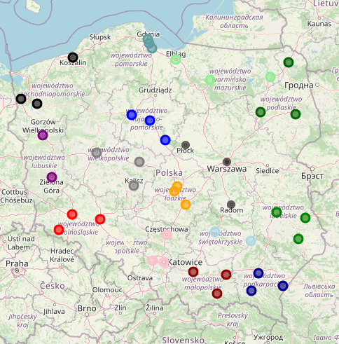

# Folium Cities



Python CLI application that bootstraps city visit data into SQLite and renders an
interactive Folium map (`.html`).

## Scope

- Local, file-based workflow (SQLite + generated HTML file).
- Deterministic seed support via `rng_seed` in service/repository layer.
- No web server, no background workers, no external API calls.

## Requirements

- Python 3.12+
- Packages listed in `requirements.txt`

## Quick Start

```powershell
python -m pip install -r requirements.txt
python main.py run --reset
```

Default outputs:

- `visits.db`
- `visits_map.html`

## CLI Contract

Entrypoint: `main.py` (calls `folium_cities.interfaces.cli.main`).

```powershell
python main.py init-db --db-path visits.db --reset
python main.py build-map --db-path visits.db --output visits_map.html
python main.py run --db-path visits.db --output visits_map.html --reset
```

If no subcommand is provided, `run` is executed.

| Command | Behavior | Options |
|---|---|---|
| `init-db` | Create schema and seed sample data | `--db-path`, `--reset` |
| `build-map` | Load visits from DB and write HTML map | `--db-path`, `--output` |
| `run` | Execute `init-db` then `build-map` | `--db-path`, `--output`, `--reset` |

| Option | Default | Notes |
|---|---|---|
| `--db-path` | `visits.db` | DB file path; parent directories are created if needed |
| `--output` | `visits_map.html` | HTML output path; parent directories are created if needed |
| `--reset` | `False` | Removes existing DB file before bootstrap |

## Module Layout

- `folium_cities/domain/` - data model (`CityVisit`) and color assignment logic.
- `folium_cities/infrastructure/sqlite_repository.py` - schema creation, seeding, query access.
- `folium_cities/infrastructure/folium_renderer.py` - map rendering and HTML output.
- `folium_cities/service.py` - orchestration (`create_database`, `generate_map`).
- `folium_cities/interfaces/cli.py` - argument parsing and process exit codes.
- `create_db.py` - backward-compatible wrapper around DB bootstrap.

## Data Flow

1. CLI parses command and options.
2. `create_database(...)` calls `bootstrap_database(...)` to create/seed SQLite.
3. `generate_map(...)` loads rows via `SQLiteCityVisitRepository.fetch_city_visits()`.
4. `FoliumMapRenderer.render(...)` converts visits to map markers and writes HTML.
5. CLI returns exit code `0` on success.

`generate_map(...)` raises `ValueError` when no visits exist in the database.

## Development

Run tests:

```powershell
pytest -q
```

Optional coverage run:

```powershell
pytest --cov=folium_cities --cov-report=term-missing
```

## Known Limitations

- SQLite schema is managed directly in code (no migration tool).
- Seed dataset is static and Poland-focused (`VOIVODESHIPS`).
- Map popup format and marker styling are fixed in renderer implementation.
- CLI does not currently expose `rng_seed` as a command-line option.

## Troubleshooting

- `ModuleNotFoundError`: reinstall dependencies (`pip install -r requirements.txt`).
- `ValueError: No city visits found...`: initialize DB first (`init-db` or `run`).
- Stale data after reruns: use `--reset` to recreate DB.
- Empty or missing output file: verify `build-map` command completed successfully and output path is writable.

## License

MIT
